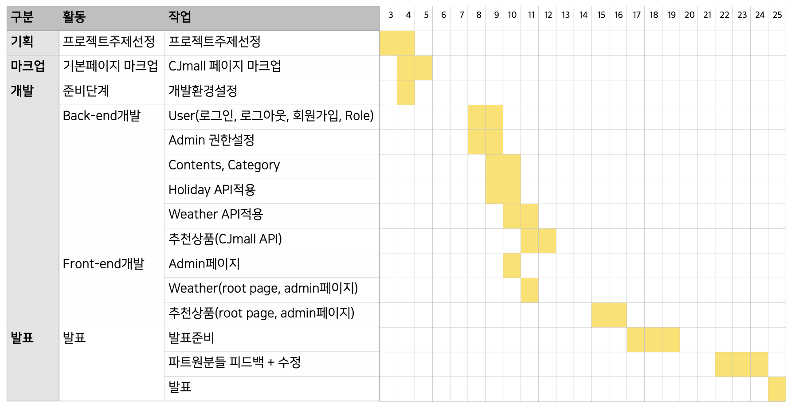
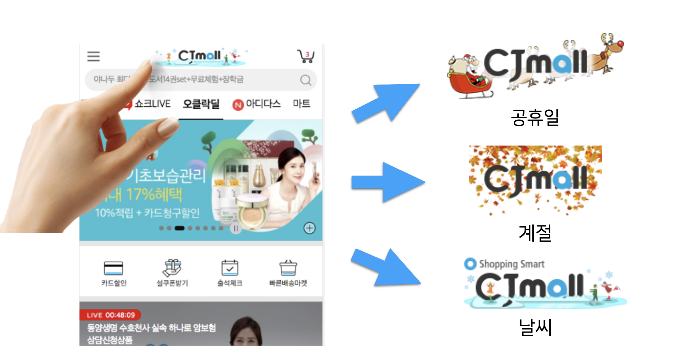
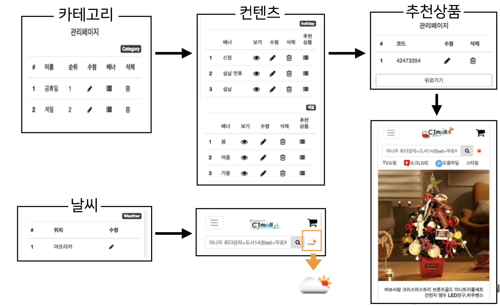
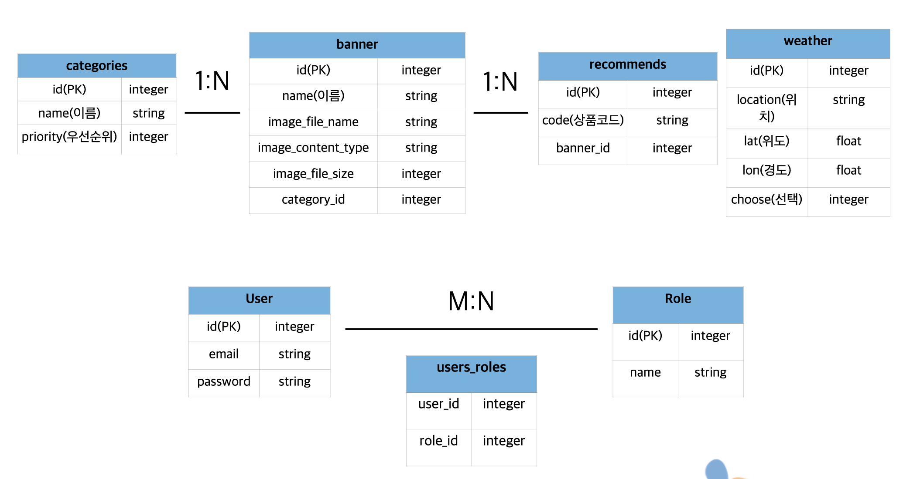
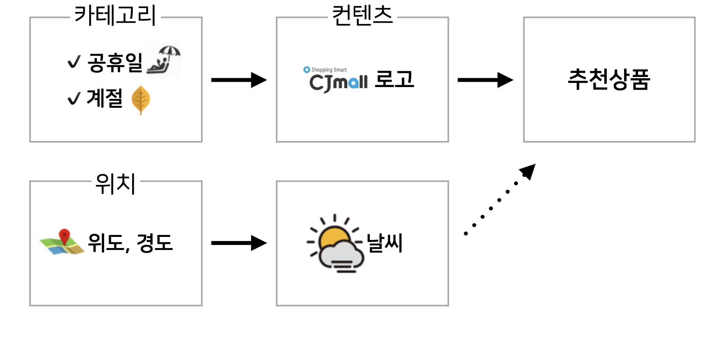

# CJ오쇼핑 인턴 프로젝트

- 프로젝트 기간 : 2018.01.03 ~ 2018.01.25
- 프로젝트 발표 : 2018.01.25

> [프로젝트 관련 준비](./schedule.md)

## 주제 / 목표

하드코딩으로 관리되고 있는 CJmall로고를 자동화를 통해 관리하고, 추후 개인화까지 확장시키는 것을 목표로한다.

- 공휴일, 특정 날에는 CJmall 로고가 자동으로 변경, 관련 상품 등록 후 추천
- 날씨 open api를 이용하여, 현재 날씨에 따른 상품 추천

## Gems(Library)

- [holidays](https://github.com/holidays/holidays) : 공휴일 정보
- [paperclip](https://github.com/thoughtbot/paperclip) : 간단한 파일 첨부 라이브러리
- [devise](https://github.com/plataformatec/devise) : 사용자 회원가입, 로그인, 로그아웃, 회원탈퇴, 권한인증 라이브러리
- [cancancan](https://github.com/CanCanCommunity/cancancan) : 인증(authorization) 라이브러리
- [rolify](https://github.com/RolifyCommunity/rolify) : 권한 라이브러리(cancancan과 함께 사용)

## API

- [openweathermap api](https://openweathermap.org/)
- [cjmall 상품 정보 api](http://display.cjmall.com/c/rest/item/<itemCode>/itemInfo.json)

## 모델

## 기대효과

- 트랜디한 CJmall 서비스
- 자동화된 서비스로 긴급 대응
- 개인화 서비스로 가기위한 첫걸음